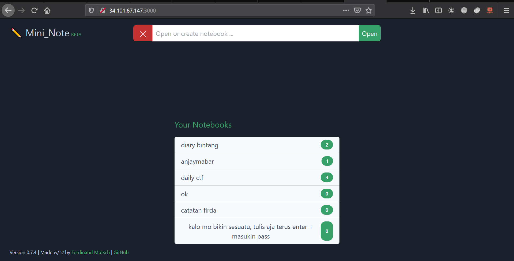

#  MiniNote


[](https://saythanks.io/to/n1try)<br>
Original Repository : https://github.com/muety/mininote
<br>
# Laporan Proyek Akhir KOM312 Komunikasi Data dan Jaringan

# Anggota
<table>
    <thead>
        <tr>
            <th></th>
            <th>Nama</th>
            <th>Nim</th>
        </tr>
    </thead>
    <tbody>
        <tr>
            <td>1</td>
            <td>Rafael Tektano Grandiawan Eknanda</td>
            <td>G64180001</td>
        </tr>
        <tr>
            <td>2</td>
            <td>Bintang Fikriguska</td>
            <td>G64180024</td>
        </tr>
        <tr>
            <td>3</td>
            <td>Alvin Ferdiansyah</td>
            <td>G64180079</td>
        </tr>
        <tr>
            <td>3</td>
            <td>Muhammad Hafizhan</td>
            <td>G64180100</td>
        </tr>
</tbody>
</table>

---

# Deskripsi Aplikasi
blablabalbla
blablablabla
blabla
---
<br>

# ⚙️Setup VPS
Kami mencoba untuk menginstall dan menjalankan aplikasi menggunakan Virtual Private Server. Untuk itu, terlebih dahulu kita perlu untuk membuat sebuah VPS dan melakukan beberapa setup. Disini kami menggunakan VPS dari **Google Cloud Product** menggunakan _credit free trial_ . Pada prosesnya, pertama kita perlu membuat sebuah VM baru pada google cloud.


Adapun details VPS yang kami setup diantaranya : <br>
- **Machine type** : n1-standard-1 (1 vCPU, 3.75 GB memory)
- **CPU platform** : Intel Skylake
- **Zone** : asia-southeast2-a
- **External IP** : 34.101.67.147 (ephemeral)
- **Operating System** : Ubuntu 20.04 LTS
- **Remote Access** : SSH<br>
<p>Karena aplikasi web akan dibuka sebagai akses publik, kita perlu untuk menyiapkan beberapa port dan rule firewall juga.</p>


<p> Kita juga harus memastikan bahwa server dapat terkoneksi menggunakan SSH. Kita dapat mengakses remote google cloud, dan login sebagai sudo untuk membuat akses baru agar server dapat diakses menggunakan SSH client, serta menambahkan beberapa pengaturan lain yang diperlukan. Setelah VPS siap digunakan, kita dapat lanjut ke langkah berikutnya yaitu mempersiapkan requirement untuk menginstall aplikasi.</p>

---

<br>

Untuk menjalankan aplikasi terdapat 2 cara, yaitu dengan cara manual dan juga docker.

# __Manual__
## ⚙️ Pre-Install Requirements
Terdapat beberapa requirements yang akan kita gunakan untuk melakukan install dan build pada aplikasi. Untuk itu, kita harus memastikan semua requirements dibawah ini terinstall dengan benar. Beberapa requirement memiliki minimal versi yang _capable_ untuk digunakan. Namun di bawah ini adalah versi dari requirement yang kami install dan gunakan.<br><br>

 **NodeJS v14.16.0**
```
$ cd ~
$ curl -sL https://deb.nodesource.com/setup_10.x -o nodesource_setup.sh
$ sudo bash nodesource_setup.sh
$ sudo apt install nodejs
```

**Yarn 1.22.5**
```
$ curl -sS https://dl.yarnpkg.com/debian/pubkey.gpg | sudo apt-key add -
$ echo "deb https://dl.yarnpkg.com/debian/ stable main" | sudo tee /etc/apt/sources.list.d/yarn.list
$ sudo apt update
$ sudo apt remove cmdtest
$ sudo apt install yarn
```

**npm 6.14.11**
```
$ sudo npm install
```
---
<br>

## ⚙️Install && Build
```
# **Clone Repositori orisinilnya**
$ git clone https://github.com/muety/mininote

# Install backend dependencies
$ yarn

# Install frontend dependencies and build
$ cd webapp && yarn && yarn build && cd ..
```
---
<br><br>
## ⌨️ Running the App
Pastikan anda sudah berada pada directory aplikasi, dan seluruh installan beserta pre-install requirement sudah terpenuhi. Apabila aplikasi diinstall pada local computer, secara default akan dijalankan pada port 3000. <br>
Sehingga kita dapat mengakses aplikasi pada localhost:3000 <br>
```
$ cd mininote
$ yarn start
```

# 🐳 __Docker__
Terdapat alternatif lain untuk menjalankan aplikasi, yaitu menggunakan docker. Docker sendiri merupakan program untuk membangun, mengemas, dan menjalankan aplikasi dengan membuatnya menjadi container (wadah).  Keuntungan menggunakan docker salah satunya adalah terisolasi, aplikasi yang terisolasi akan terpisah dan tidak akan mengganggu host apabila terdapat masalah (Mirip seperti VM). <br><br>

## ⚙️ Pre-Install Requirements:
**Docker**
```
$ sudo apt-get update
$ sudo apt-get install \
    apt-transport-https \
    ca-certificates \
    curl \
    gnupg \
    lsb-release
$ curl -fsSL https://download.docker.com/linux/ubuntu/gpg | sudo gpg --dearmor -o /usr/share/keyrings/docker-archive-keyring.gpg
$ echo \
  "deb [arch=amd64 signed-by=/usr/share/keyrings/docker-archive-keyring.gpg] https://download.docker.com/linux/ubuntu \
  $(lsb_release -cs) stable" | sudo tee /etc/apt/sources.list.d/docker.list > /dev/null
$ sudo apt-get install docker-ce docker-ce-cli containerd.io
```

## ⌨️ Running the App
```
# Membuat volume persistent yang akan digunakan aplikasi
$ docker volume create mininote-data

# Mendownload image dari docker hub, membuat container, lalu menjalankannya
$ docker run -d -p 3000:3000 -v mininote-data:/app/data --name mininote n1try/mininote
```
<p> Setelah command tersebut dijalankan, aplikasi langsung bisa diakses secara publik di port 3000. </p>


---

<br><br>
## 🔒 Setup HTTPS pada backend
blablabla
---

<br><br>
## 📓 License
MIT @ [Ferdinand Mütsch](https://muetsch.io)
