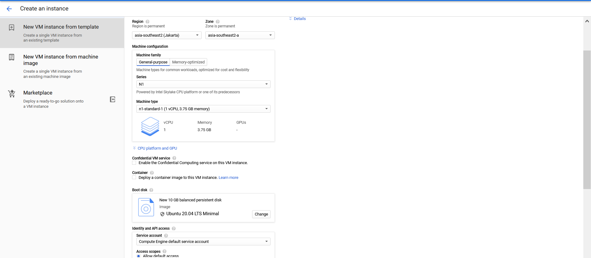
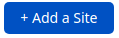

#  MiniNote


[](https://saythanks.io/to/n1try)<br>
Original Repository : https://github.com/muety/mininote
<br>
# Laporan Proyek Akhir KOM312 Komunikasi Data dan Jaringan

# Anggota
<table>
    <thead>
        <tr>
            <th></th>
            <th>Nama</th>
            <th>Nim</th>
        </tr>
    </thead>
    <tbody>
        <tr>
            <td>1</td>
            <td>Rafael Tektano Grandiawan Eknanda</td>
            <td>G64180001</td>
        </tr>
        <tr>
            <td>2</td>
            <td>Bintang Fikriguska</td>
            <td>G64180024</td>
        </tr>
        <tr>
            <td>3</td>
            <td>Alvin Ferdiansyah</td>
            <td>G64180079</td>
        </tr>
        <tr>
            <td>3</td>
            <td>Muhammad Hafizhan</td>
            <td>G64180100</td>
        </tr>
</tbody>
</table>

---

# 📒 Deskripsi Aplikasi
---
Aplikasi ini adalah aplikasi **Markdown Note** garapan [_muety_](https://github.com/muety/mininote) bersifat _self-hosted_ menggunakan [Vue 3](https://v3.vuejs.org) dan [Express](http://expressjs.com). Aplikasi ini dapat membuat sebuah teks dengan format markdown serta dapat langsung direpresentasikan. Sebagai tambahan, anda dapat mempelajari markdown di [link berikut ini](https://www.markdownguide.org/basic-syntax/) untuk memudahkan penggunaan.


Aplikasi ini memiliki beberapa fitur sederhana, diantaranya :</br>
- **Membuat Sebuah Repository**</br>Pengguna dapat membuat repository dari notenya sendiri dengan fitur penamaan repository beserta password untuk mengakses. Password dan nama respository dapat diubah</br>
- **Markdown Editor**</br>Pengguna dapat menuliskan teks dengan format markdown dan sistem dapat langsung menampilkan hasilnya (pada Kotak A)
- **Membuat Note Baru**</br>Pengguna dapat membuat note baru (pada Kotak C)
- **Mencari Note**</br>Dapat dilihat pada Kotak B
- **Menyimpan dan Mengubah Nama serta Password**</br>Dapat dilihat dan diakses pada tab label D


# ⚙️Setup VPS
Kami mencoba untuk menginstall dan menjalankan aplikasi menggunakan Virtual Private Server. Untuk itu, terlebih dahulu kita perlu untuk membuat sebuah VPS dan melakukan beberapa setup. Disini kami menggunakan VPS dari **Google Cloud Product** menggunakan _credit free trial_ . Pada prosesnya, pertama kita perlu membuat sebuah VM baru pada google cloud.


Adapun details VPS yang kami setup diantaranya : <br>
- **Machine type** : n1-standard-1 (1 vCPU, 3.75 GB memory)
- **CPU platform** : Intel Skylake
- **Zone** : asia-southeast2-a
- **External IP** : 34.101.67.147 (ephemeral)
- **Operating System** : Ubuntu 20.04 LTS
- **Remote Access** : SSH<br>
<p>Karena aplikasi web akan dibuka sebagai akses publik, kita perlu untuk menyiapkan beberapa port dan rule firewall juga.</p>


<p> Kita juga harus memastikan bahwa server dapat terkoneksi menggunakan SSH. Kita dapat mengakses remote google cloud, dan login sebagai sudo untuk membuat akses baru agar server dapat diakses menggunakan SSH client, serta menambahkan beberapa pengaturan lain yang diperlukan. Setelah VPS siap digunakan, kita dapat lanjut ke langkah berikutnya yaitu mempersiapkan requirement untuk menginstall aplikasi.</p>


---

<br>

Untuk menjalankan aplikasi terdapat 2 cara, yaitu dengan cara manual dan juga docker.

# **__1. Manual__**
## ⚙️ Pre-Install Requirements
Terdapat beberapa requirements yang akan kita gunakan untuk melakukan install dan build pada aplikasi. Untuk itu, kita harus memastikan semua requirements dibawah ini terinstall dengan benar. Beberapa requirement memiliki minimal versi yang _capable_ untuk digunakan. Namun di bawah ini adalah versi dari requirement yang kami install dan gunakan.<br><br>

 **NodeJS v14.16.0**
```
$ cd ~
$ curl -sL https://deb.nodesource.com/setup_10.x -o nodesource_setup.sh
$ sudo bash nodesource_setup.sh
$ sudo apt install nodejs
```

**Yarn 1.22.5**
```
$ curl -sS https://dl.yarnpkg.com/debian/pubkey.gpg | sudo apt-key add -
$ echo "deb https://dl.yarnpkg.com/debian/ stable main" | sudo tee /etc/apt/sources.list.d/yarn.list
$ sudo apt update
$ sudo apt remove cmdtest
$ sudo apt install yarn
```

**npm 6.14.11**
```
$ sudo npm install
```
---
<br>

## ⚙️Build && Run
```
# **Clone Repositori orisinilnya**
$ git clone https://github.com/muety/mininote

# Install backend dependencies
$ yarn

# Install frontend dependencies and build
$ cd webapp && yarn && yarn build && cd ..
```
<p> Pastikan anda sudah berada pada directory aplikasi, dan seluruh installan beserta pre-install requirement sudah terpenuhi. Apabila aplikasi diinstall pada local computer, secara default akan dijalankan pada port 3000. Sehingga kita dapat mengakses aplikasi pada localhost:3000. Setelah build berhasil, kita dapat langsung menjalankan aplikasi. </p>

```
$ cd mininote
$ yarn start
```

# 🐳 **__2. Docker__**
Terdapat alternatif lain untuk menjalankan aplikasi, yaitu menggunakan docker. Docker sendiri merupakan program untuk membangun, mengemas, dan menjalankan aplikasi dengan membuatnya menjadi container (wadah).  Keuntungan menggunakan docker salah satunya adalah terisolasi, aplikasi yang terisolasi akan terpisah dan tidak akan mengganggu host apabila terdapat masalah (Mirip seperti VM). <br><br>

## ⚙️ Pre-Install Requirements:
**Docker**
```
$ sudo apt-get update
$ sudo apt-get install \
    apt-transport-https \
    ca-certificates \
    curl \
    gnupg \
    lsb-release
$ curl -fsSL https://download.docker.com/linux/ubuntu/gpg | sudo gpg --dearmor -o /usr/share/keyrings/docker-archive-keyring.gpg
$ echo \
  "deb [arch=amd64 signed-by=/usr/share/keyrings/docker-archive-keyring.gpg] https://download.docker.com/linux/ubuntu \
  $(lsb_release -cs) stable" | sudo tee /etc/apt/sources.list.d/docker.list > /dev/null
$ sudo apt-get install docker-ce docker-ce-cli containerd.io
```

## ⌨️ Running the App
```
# Membuat volume persistent yang akan digunakan aplikasi
$ docker volume create mininote-data

# Mendownload image dari docker hub, membuat container, lalu menjalankannya
$ docker run -d -p 127.0.0.1:3000:3000 -v mininote-data:/app/data --name mininote n1try/mininote
```
<p> Setelah command tersebut dijalankan, aplikasi bisa diakses di localhost port 3000 sama seperti penginstalan manual. </p>

---

<br><br>
# 🔒 Setup domain dan SSL
Kami menggunakan cloudflare sebagai server penghubung antara server asli dengan visitor. Cloudflare sendiri adalah Content Delivery Network (CDN) yang memiliki banyak fasilitas, beberapa diataranya adalah sebagai berikut:
- Mitigasi serangan DDoS.
- Analytics request yang mengakses website.
- Instalasi sertifikat SSL.
- DNS
- Dll.

Oleh karena itu kami menggunakannya untuk instalasi SSL dan sebagai DNS.

Di sisi server, kami menggunakan nginx sebagai web server untuk melakukan setup domain dan sertikat SSL yang telah diberikan oleh cloudflare pada server. Selain itu, nginx juga digunakan untuk melakukan reverse proxy ke port tertentu tempat aplikasi berada.

## ⚙️ Requirements:
**nginx**
```
$ sudo apt install nginx
```

## **Konfigurasi Cloudflare**

Register dan login pada akun cloudflare. Setelah itu tambahkan domain dengan menekan tombol `add site`

> 

Masukkan domain website anda.

> 

setelah itu pilih free plan jika ingin menggunakan plan yang gratis.

> 

Akan terdapat table untuk menambahkan record DNS, masukkan IP publik server anda ke dalam record domain yang anda inginkan tersebut.

> 

Ganti nameserver anda pada domain registrar dengan nameserver cloudflare.

> 

Setelah nameserver diubah, pilih tab `SSL/TLS`, lalu tab `Origin Server`, dan pilih `create certificate`. Akan ada tampilan seperti berikut:

> 

Setelah tombol `Create` ditekan, akan terdapat `origin certificate` dan `private key`. Copy dan simpan `origin certificate` ke dalam file `/etc/ssl/certs/cert.pem` dan `private key` ke dalam file `/etc/ssl/private/priv.key`. (File bisa diubah sesuai keinginan)

## **Konfigurasi nginx**

Tambahkan file konfigurasi `/etc/nginx/sites-available/mininote` dengan isi sebagai berikut:
```
server {
    listen 80;
    listen [::]:80;
    
    # Sesuaikan dengan domain anda
    server_name mininote.bintangfikriguska.my.id www.mininote.bintangfikriguska.my.id;

    return 302 https://$server_name$request_uri;
}

server {
        listen 443 ssl http2;
        listen [::]:443 ssl http2;

        # Sesuaikan dengan domain anda
        server_name mininote.bintangfikriguska.my.id www.mininote.bintangfikriguska.my.id;
        
        # Sesuai dengan sertifikat file yang terdapat di server anda
        ssl_certificate /etc/ssl/certs/cert.pem;
        ssl_certificate_key /etc/ssl/private/priv.key;

        access_log /var/log/nginx/reverse-access.log;
        error_log /var/log/nginx/reverse-error.log debug;

        location / {

                proxy_set_header        Host $host;
                proxy_set_header        X-Real-IP $remote_addr;
                proxy_set_header        X-Forwarded-For $proxy_add_x_forwarded_for;
                proxy_set_header        X-Forwarded-Proto $scheme;
                
                proxy_pass              http://localhost:3000;
        }
}
```
Setelah itu buat symbolic link (symlink) `/etc/nginx/sites-enabled/mininote` yang mengarah ke `/etc/nginx/sites-available/mininote`. Setelah membuat symlink di dalam folder tersebut, file konfigurasi yang telah kita buat tersebut diaggap aktif oleh nginx. Alasan digunakannya symlink di folder `sites-enabled` adalah agar lebih terorganisir, jadi apabila ingin menonaktifkan file konfigurasi (menghapus symlink) dan suatu saat ingin mengaktifkannya lagi, tinggal membuat symlink yang baru ke folder `sites-enabled`.

```
$ sudo ln -s /etc/nginx/sites-available/mininote /etc/nginx/sites-enabled/
```
Lakukan *reload* file konfigurasi nginx.
```
$ sudo nginx -s reload
```

Setelah itu, aplikasi sudah bisa diakses menggunakan domain kita yang sudah terinstal ssl. Web akhir aplikasi dapat diakses secara publik pada web berikut : [MiniNote](https://mininote.bintangfikriguska.my.id/)


---

<br><br>
## 📓 License
MIT @ [Ferdinand Mütsch](https://muetsch.io)
